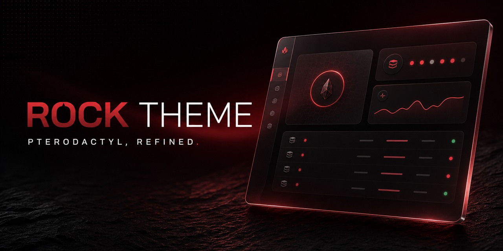

# Rock Theme



This image is also sized for the repository's GitHub social preview.

Rock Theme is a responsive crimson interface for
[Pterodactyl Panel](https://pterodactyl.io). It refreshes the client, login,
server, and administration experiences while keeping the underlying panel
workflow familiar.

Built by [DevRock](https://github.com/devrock07) for Pterodactyl `1.15.0`.

Version 2.0 delivers a viewport-safe notification center and a rebuilt crimson
mobile navigation surface, with matching behavior across phone and desktop layouts.

## Highlights

-   Unified dark-red visual system across the client and admin panels
-   Responsive layouts for desktop, tablet, and mobile
-   Configurable panel name, footer, mark or logo, dashboard copy, and artwork
-   Admin Theme Studio with presets, custom accent, glass, radius, motion,
    login artwork, console appearance, and live preview
-   Command palette, account-synced favorites and server groups, permission-aware
    quick controls, and durable resource notifications
-   Live, one-hour, and 24-hour telemetry views with seven-day server-side retention
-   Mobile bottom navigation and polished loading skeletons
-   Branded public status page at `/status` backed by live Wings node health checks
-   Admin-controlled global announcement banner with notice, warning, and critical modes
-   Soft Aurora, Magic Bento, Fluid Glass, Profile Card, spotlight, and motion
    treatments adapted for the panel
-   Seamless pointer ambience, polished page transitions, magnetic controls,
    responsive navigation scrims, and card-local lighting without clipped glow
-   Reduced-motion and coarse-pointer fallbacks for accessible mobile use
-   Production release archives with compiled frontend assets
-   Daily upstream autopilot that ports the theme to verified Pterodactyl releases
    and publishes only after the complete frontend and database matrix passes

## Compatibility

| Requirement       | Supported version |
| ----------------- | ----------------- |
| Pterodactyl Panel | `1.15.0`          |
| PHP               | `8.2` or `8.3`    |
| Node.js           | `22` or newer     |
| Yarn              | Classic `1.x`     |

Rock Theme is a full panel overlay. Back up the panel database and `.env`
before installing it, and test upgrades in a staging environment first.

## Installation & Management

Run the verified Rock Theme shell manager to install, update, or restore a
manager-created pre-theme backup interactively:

```bash
bash <(curl -fsSL https://raw.githubusercontent.com/devrock07/Rock-Theme/main/install.sh)
```

The script presents a menu with three options:
1. **Install Theme** – Verifies the latest release checksum, saves the original panel, and installs the compiled theme.
2. **Update Theme** – Creates a safety backup and installs the latest verified release.
3. **Restore Backup** – Restores the manager-created pre-theme files while preserving the current `.env` and `storage` directory.

Failed downloads never touch the panel. If an operation fails after maintenance
mode begins, the manager automatically brings the panel back online.

### Manual Installation

For direct installation without the manager:

```bash
cd /var/www/pterodactyl

php artisan down

curl -fL -o panel.tar.gz https://github.com/devrock07/Rock-Theme/releases/latest/download/panel.tar.gz
curl -fL -o panel.tar.gz.sha256 https://github.com/devrock07/Rock-Theme/releases/latest/download/panel.tar.gz.sha256
sha256sum --check panel.tar.gz.sha256
tar -xzf panel.tar.gz
rm panel.tar.gz panel.tar.gz.sha256

composer install --no-dev --optimize-autoloader
php artisan migrate --seed --force
php artisan view:clear
php artisan config:clear
php artisan route:clear
php artisan queue:restart

chown -R www-data:www-data /var/www/pterodactyl
chmod -R 755 storage bootstrap/cache

php artisan up
```

Replace `www-data` with the account used by your web server when necessary.
The normal Pterodactyl scheduler (`php artisan schedule:run` every minute) also
collects Rock Theme telemetry every five minutes and removes samples older than
seven days.

## Branding

Open **Admin → Settings** to configure the public identity and Theme Studio without
editing the theme source. See [BRANDING.md](./BRANDING.md) for the available
settings, local image paths, and favicon locations.

## Development

```bash
yarn install --frozen-lockfile
yarn tsc
yarn lint
yarn build:production
```

Development setup and release packaging are documented in
[BUILDING.md](./BUILDING.md).

Upstream release automation is documented in
[UPSTREAM_AUTOMATION.md](./UPSTREAM_AUTOMATION.md).

## Support

-   Report Rock Theme bugs through
    [GitHub Issues](https://github.com/devrock07/Rock-Theme/issues).
-   Use the [Pterodactyl documentation](https://pterodactyl.io) for panel,
    Wings, node, and game-server configuration.
-   Review [SECURITY.md](./SECURITY.md) before reporting a vulnerability.

Please reproduce theme issues on Pterodactyl `1.15.0` and include the browser,
screen size, affected view, and screenshots.

## Credits and licenses

Rock Theme is a derivative Pterodactyl panel distribution and includes work
from the NookTheme project. Rock Theme is not affiliated with Pterodactyl,
Nookure, or React Bits.

-   Pterodactyl code is distributed under the [MIT License](./LICENSE.md).
-   NookTheme-derived edits and Rock Theme modifications are distributed under
    the [GNU GPLv3](./NookLicense.md), subject to third-party terms.
-   Adapted component notices and additional license conditions are listed in
    [THIRD_PARTY_NOTICES.md](./THIRD_PARTY_NOTICES.md).

Copyright © 2022–2026 DevRock. Upstream copyright notices remain with their
respective owners.
