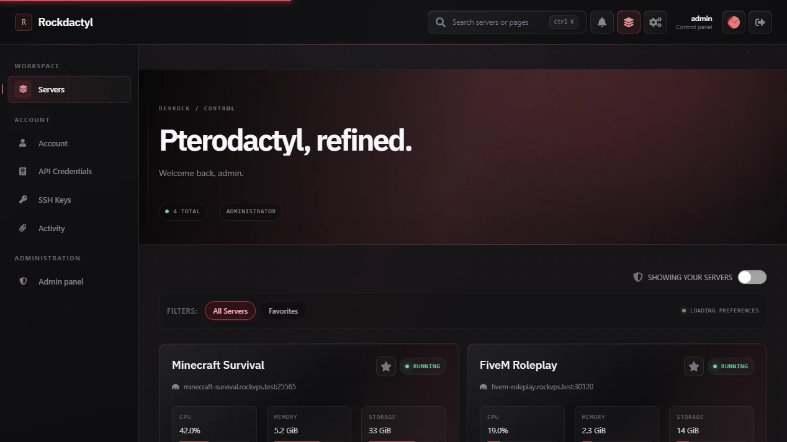

<div align="center">

# Rockdactyl

A polished, responsive UI mod for Pterodactyl Panel.

Formerly **Rock Theme**. Existing installer, backup, and container identifiers
remain compatible.

[](https://github.com/devrock07/Rockdactyl/releases/latest)
[](https://github.com/devrock07/Rockdactyl/actions/workflows/build.yaml)
[](https://github.com/devrock07/Rockdactyl/actions/workflows/ci.yaml)
[](https://github.com/pterodactyl/panel/releases/tag/v1.15.1)
[](./LICENSE)



**Rockdactyl `v2.1.1` · Pterodactyl Panel `v1.15.1`**

[Website](https://devrock07.github.io/Rockdactyl/) · [Documentation](./docs/README.md) · [Install](./docs/INSTALLATION.md) · [Releases](https://github.com/devrock07/Rockdactyl/releases)

</div>

## Install

> [!CAUTION]
> Back up the panel database and `.env` before installing.

Run on an existing Pterodactyl `1.15.1` installation:

```bash
curl -fsSL https://raw.githubusercontent.com/devrock07/Rockdactyl/main/install.sh \
  -o /tmp/rockdactyl-install.sh
sudo bash /tmp/rockdactyl-install.sh install
```

The manager verifies checksums and archive structure before changing the panel. See the [installation guide](./docs/INSTALLATION.md) for updates, restore, custom paths, and manual deployment.

<details>
<summary><strong>What Rockdactyl includes</strong></summary>

Rockdactyl modernizes the client, server, login, status, and administration interfaces while preserving the familiar Pterodactyl workflow. It is a complete panel distribution—not a CSS patch or runtime plugin.

Rockdactyl `v2.1.1` is based on and supports [Pterodactyl Panel `v1.15.1`](https://github.com/pterodactyl/panel/releases/tag/v1.15.1).

| Area | Included |
| --- | --- |
| Visual system | Crimson Red and Midnight Blue across client and admin surfaces |
| Theme Studio | Identity, media, glass, radius, motion, favicons, and console appearance |
| Panel controls | Search, command palette, favorites, groups, quick actions, and mobile navigation |
| Operations | Resource history, persistent notifications, announcements, and public status |
| Delivery | Verified releases, rollback snapshots, recovery guards, and upstream automation |

</details>

<details>
<summary><strong>Compatibility</strong></summary>

| Component | Supported |
| --- | --- |
| Rockdactyl | `2.1.1` |
| Pterodactyl Panel | `1.15.1` |
| PHP | `8.2` and `8.3` |
| Source builds | Node.js `22+` and Yarn Classic `1.x` |
| Containers | `linux/amd64` and `linux/arm64` |

Upgrade themed installations through a compatible Rockdactyl release. Do not run the official Pterodactyl updater directly over theme files.

</details>

<details>
<summary><strong>Documentation and project guides</strong></summary>

- [Documentation index](./docs/README.md)
- [Configuration](./docs/CONFIGURATION.md)
- [Operator recipes](./docs/RECIPES.md)
- [Upgrading and recovery](./docs/UPGRADING.md)
- [Troubleshooting](./docs/TROUBLESHOOTING.md)
- [Architecture](./docs/ARCHITECTURE.md)
- [Building from source](./docs/development/BUILDING.md)
- [Contributing](./.github/CONTRIBUTING.md)
- [Roadmap](./docs/project/ROADMAP.md)
- [Changelog](./CHANGELOG.md)

The documentation website source lives in [`website/`](./website) and uses only real screenshots captured from the running panel.

</details>

<details>
<summary><strong>Support, security, and licensing</strong></summary>

Use [GitHub Issues](https://github.com/devrock07/Rockdactyl/issues) for reproducible bugs, [GitHub Discussions](https://github.com/devrock07/Rockdactyl/discussions) for usage questions, and the [support guide](./.github/SUPPORT.md) to choose the right channel. Report vulnerabilities through the [security policy](./SECURITY.md), never a public issue.

Rockdactyl is a derivative Pterodactyl panel distribution containing NookTheme-derived work and adapted third-party interface components. It is not affiliated with Pterodactyl, Nookure, or React Bits.

- Rockdactyl and applicable NookTheme-derived modifications are distributed under [GNU GPLv3](./LICENSE), subject to third-party terms.
- Pterodactyl code retains its [MIT license](./PTERODACTYL_LICENSE.md).
- Component licenses and attribution are in the [third-party notices](./THIRD_PARTY_NOTICES.md).

Copyright © 2022–2026 DevRock. Upstream notices remain with their respective owners.

</details>
