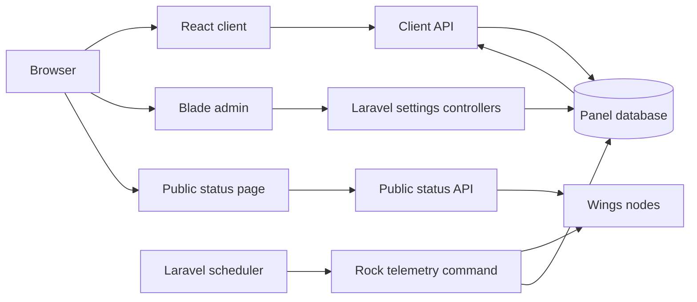
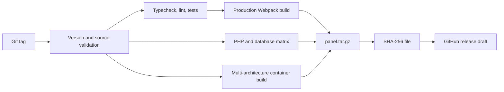

# Architecture

Rockdactyl is a maintained fork and full distribution of Pterodactyl Panel,
not a detached stylesheet. It combines the upstream Laravel application and
React client with theme-specific UI, configuration, persistence, telemetry,
and release engineering.

## System overview



The existing Pterodactyl authentication, authorization, server APIs, and Wings
protocol remain the foundation. Theme additions use the current signed-in
account and normal server permissions rather than creating a parallel identity
or control plane.

## Application layers

### Client application

The signed-in panel, login flow, and public status interface are React and
TypeScript under `resources/scripts/`. Styling combines Tailwind utilities,
styled-components, CSS modules, and theme-level CSS variables.

Relevant theme areas include:

```text
resources/scripts/assets/css/GlobalStylesheet.ts
resources/scripts/components/dashboard/
resources/scripts/components/notifications/
resources/scripts/components/status/
resources/scripts/components/elements/reactbits/
resources/scripts/components/server/console/
```

The palette is exposed through shared accent variables so Crimson Red and
Midnight Blue can drive navigation, controls, charts, glass, and effects
without separate component forks. Motion-sensitive components also use device
capability and reduced-motion fallbacks.

### Administration interface

Pterodactyl's server-rendered administration interface remains Blade-based.
Rockdactyl extends it through:

```text
resources/views/admin/
resources/views/layouts/admin.blade.php
public/themes/pterodactyl/css/admin-rockvps.css
public/themes/pterodactyl/js/admin/reactbits-effects.js
```

Admin settings are validated by
`BaseSettingsFormRequest`, written transactionally to the existing settings
repository, and loaded into Laravel configuration by
`SettingsServiceProvider`. The controller attempts to restart queue workers
after each successful save.

### Configuration delivery

`config/branding.php` defines environment-backed defaults. `AssetComposer`
serializes effective branding into the frontend boot payload. Database settings
therefore drive both Blade-rendered admin pages and the React application.

The data path is:

```text
.env fallback
    → config/branding.php
    → database settings override
    → AssetComposer / Blade layout
    → React and admin CSS variables
```

This is why a value already saved in Admin Settings takes precedence over a
later `.env` edit.

## Rockdactyl data model

Migration `2026_08_03_000001_create_rock_theme_data_tables` adds three tables.

| Table                    | Purpose                                                                                        | Lifecycle                                                                                     |
| ------------------------ | ---------------------------------------------------------------------------------------------- | --------------------------------------------------------------------------------------------- |
| `rock_user_preferences`  | JSON map of favorite and group values keyed by server for one user                             | One row per user; deleted with the user                                                       |
| `rock_telemetry_samples` | Server state, CPU, memory, disk, received bytes, and transmitted bytes at a recorded minute    | Unique per server/minute; samples older than seven days are pruned; deleted with the server   |
| `rock_notifications`     | Per-user offline, recovery, and CPU notifications with optional server link and read timestamp | Unread API returns the latest 30; deleted with the user and detached if its server is deleted |

### Preference synchronization

The client loads and updates preferences through
`/api/client/account/rock`. Updates are serialized in the UI so rapid favorite
or group changes cannot overwrite newer local intent. When database storage is
temporarily unavailable, the API returns a retryable 503 and the browser keeps
a local working copy.

### Notifications

The notification API is scoped to the authenticated user. Mark-read and
clear-all operations update only that user's unread rows. The client maintains
a retry outbox so a temporary API failure does not make a read notification
permanently reappear.

Notifications are created while telemetry records meaningful state changes.
CPU warnings are de-duplicated for one hour per server.

### Telemetry

The Laravel scheduler executes `rock:telemetry` every five minutes. The command
prunes expired samples, retrieves current utilization from Wings for installed
servers without an active status transition, and isolates errors per server.
The normal resource-utilization endpoint can also record a current sample.

Authenticated history requests support one-hour and 24-hour ranges and reduce
large result sets to approximately 120 returned points. Access passes through
the normal Pterodactyl server-access middleware.

### Public status

The public React route `/status` reads `/api/public/status`. The API is disabled
with a 404 when the operator hides the page. When enabled, it checks Wings
system information, categorizes each node as operational, maintenance, or
unavailable, applies the configured disclosure mode, and caches the response
for 45 seconds.

## Build and release pipeline

The frontend uses Node.js 22, Yarn Classic, Webpack 5, TypeScript, ESLint, and
Jest. Production builds clean old generated assets and write hashed bundles plus
`manifest.json` under `public/assets/`.

The source repository intentionally ignores generated bundles. A release
archive is assembled from the committed tree, then receives the freshly built
`public/assets/`. Tests and GitHub workflow files are removed from the install
archive. A SHA-256 checksum is generated beside it.



The regular GitHub Actions surface is split by responsibility:

| Workflow           | Trigger                               | Responsibility                                                                                                                    |
| ------------------ | ------------------------------------- | --------------------------------------------------------------------------------------------------------------------------------- |
| Frontend           | Push/PR to `main`, manual             | Installer smoke tests, TypeScript, ESLint, Jest, production build                                                                 |
| Backend            | Push/PR to `main`, manual             | PHP formatting, unit tests, and integration tests across PHP 8.2/8.3 and four database targets                                    |
| Release            | Human-pushed version tag              | Version validation, frontend validation, full backend matrix, multi-architecture container gate, archive, checksum, draft release |
| Container          | `main`, published release, PR, manual | Pull-request image validation and multi-architecture `linux/amd64`/`linux/arm64` publishing to GHCR                               |
| Upstream Autopilot | Daily, manual                         | Official release detection, three-tree merge, full candidate validation, fast-forward promotion, release, and container dispatch  |

## Upstream maintenance boundary

The upstream base tag is stored in `.rock/upstream-version`. The automated
update workflow fetches the old and new official Pterodactyl tag trees and uses
Git's three-tree merge machinery to distinguish upstream changes from Rock
Theme customizations.

The automation treats a small set of repository-owned release files as
protected. Application conflicts outside that set block promotion. A candidate
must pass the frontend job, every backend matrix entry, and the
multi-architecture container build before `main` can be fast-forwarded and a
release created. Published container channels carry commit-specific source
markers. Later runs compare the tag, release assets, and GHCR aliases with the
exact `main` commit and reconcile incomplete publication without rebuilding a
healthy release. Downgrades and tag movement are rejected.

See [Upstream Autopilot](./development/UPSTREAM_AUTOMATION.md) for repository
permissions and the manual dispatch procedure.

## Security and privacy boundaries

-   Client APIs remain authenticated and use Pterodactyl account/server access
    middleware.
-   Preference and notification queries are always scoped to the signed-in user.
-   Telemetry history is scoped to an authorized server request.
-   The status endpoint is intentionally public when enabled; operators control
    whether node names and item-level status are disclosed.
-   Dashboard, login, console, and logo URLs are rendered in users' browsers;
    operators should use trusted media origins.
-   Release checksum verification detects transfer corruption or a mismatched
    asset, but it does not replace host hardening, secure backups, or release
    review.

Potential vulnerabilities should be reported through the private process in
[SECURITY.md](../SECURITY.md), not through a public issue.

## Design constraints for changes

Contributions should preserve these boundaries:

-   upstream Pterodactyl behavior and permission checks remain authoritative;
-   decorative effects must not block input, modals, dropdowns, or file actions;
-   responsive behavior must work without horizontal page scrolling;
-   keyboard focus, reduced motion, touch targets, and readable contrast are part
    of the feature, not optional polish;
-   asynchronous requests need explicit loading, error, retry, and stale-response
    behavior; and
-   database-backed additions require migrations, failure isolation, and tests.

Use the [building guide](./development/BUILDING.md) for required checks and
[contribution guide](../.github/CONTRIBUTING.md) for pull-request expectations.
